<picture>
  <source media="(prefers-color-scheme: dark)"
    srcset="https://raw.githubusercontent.com/lnwnrng/lnwnrng/output/github-snake-dark.svg" />
  <source media="(prefers-color-scheme: light)"
    srcset="https://raw.githubusercontent.com/lnwnrng/lnwnrng/output/github-snake.svg" />
  
</picture>
